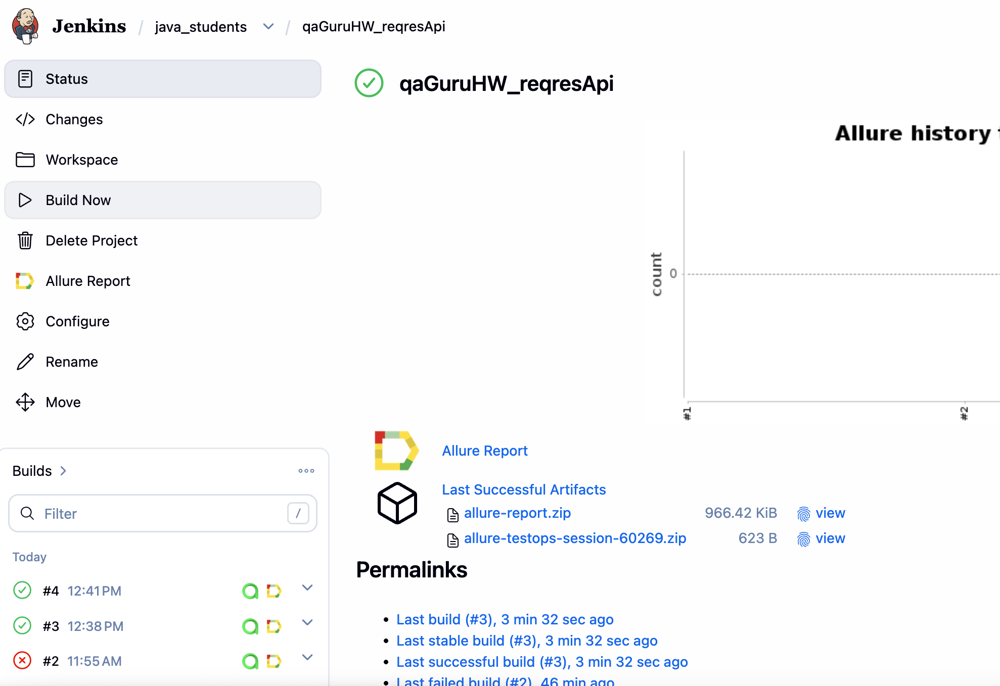
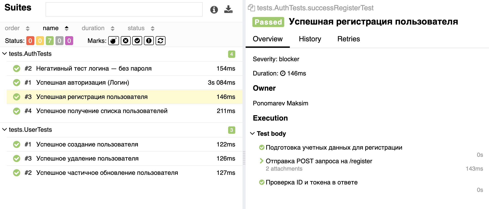
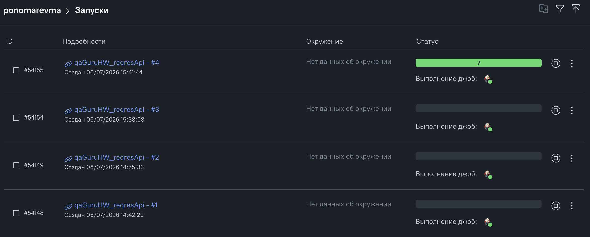
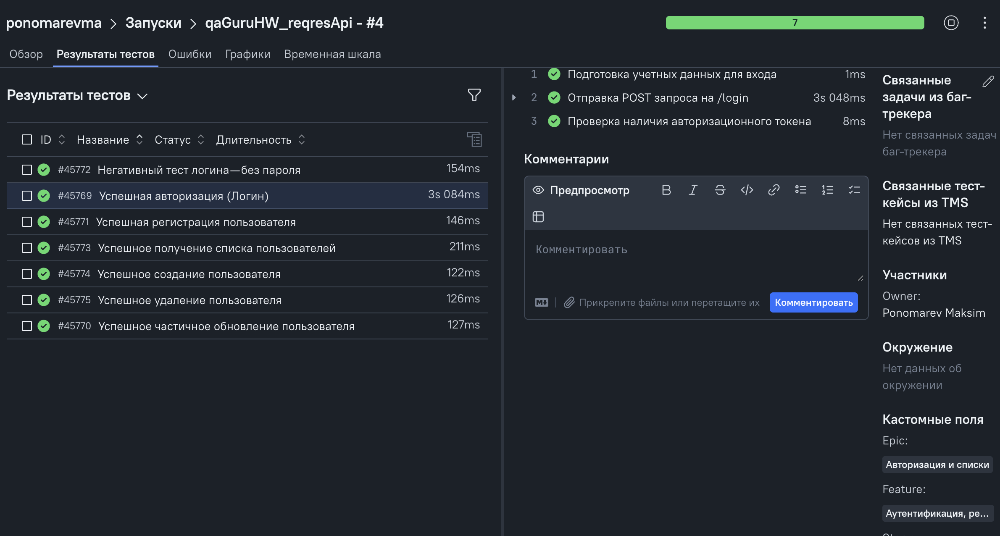
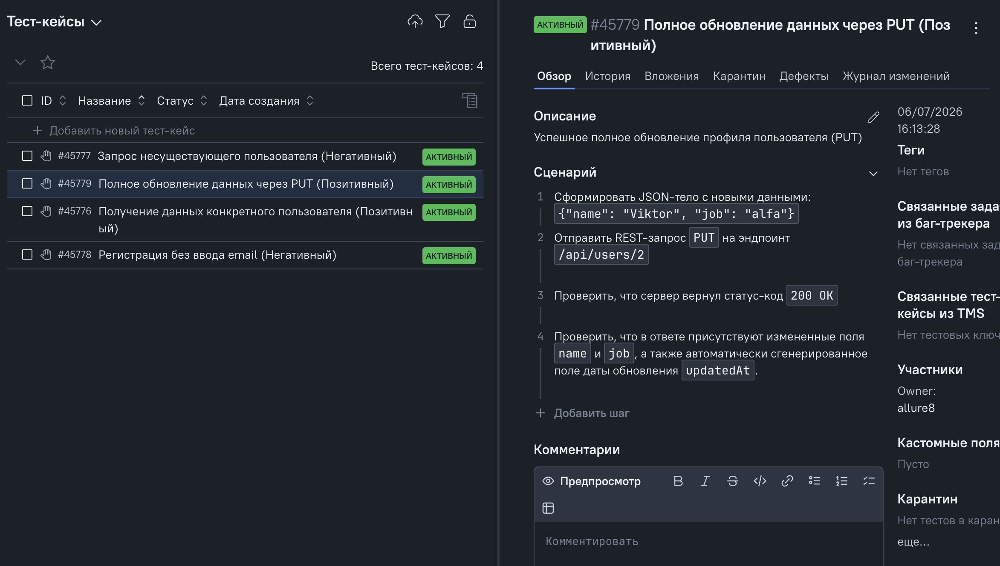

# Автоматизация тестирования API проекта ReqRes.in

> Проект выполнен в рамках дипломной работы курса **QA.GURU**. фреймворк построен на базе Java и современных инструментов автоматизации с интеграцией в CI/CD и Test Management System.

---

## 🚀 Технологический стек


* **Язык программирования:** Java 17
* **Тестовый фреймворк:** JUnit 5
* **Тестирование API:** Rest Assured
* **Сборщик проекта:** Gradle (Allure Plugin v4)
* **Архитектура:** Конфигурация через Owner (Type-safe properties), разделение моделей на Request/Response DTO
* **Логирование:** Кастомные HTML/Txt шаблоны для Rest Assured в Allure
* **CI/CD:** Jenkins Пайплайн
* **TMS (Управление тестами):** Allure TestOps (Синхронизация автотестов и ручных тест-кейсов)

---

## 🛠️ Особенности архитектуры проекта

1. **Разделение моделей (DTO):** Для чистоты кода и масштабируемости все POJO-модели (с использованием Lombok и Jackson) разнесены по пакетам `models/request` и `models/response`.
2. **Слой конфигурации (Owner):** Все ключевые параметры (`baseUrl`, `basePath`, API-токены) вынесены в `api.properties` и управляются через интерфейс Owner. Никакого хардкода в спецификациях.
3. **Универсальные спецификации:** Повторяющийся код запросов и валидация статус-кодов инкапсулированы в `UserSpecs`.
4. **Allure TestOps интеграция:** Проект настроен на работу с `allurectl` (v4). Автотесты содержат мета-данные (`@Layer`, `@Microservice`, `@AllureId`, `@Owner`), что позволяет автоматически синхронизировать их с ручными проверками.

---

## 🧪 Покрытие тест-кейсов

В рамках проекта реализовано гибридное покрытие (автотесты + ручные сценарии на Allure TestOps):

### Автоматизированные тесты (Rest Assured)
* `POST /api/users` — Успешное создание пользователя
* `PATCH /api/users/2` — Успешное частичное обновление данных
* `DELETE /api/users/2` — Успешное удаление пользователя
* `POST /api/register` — Успешная регистрация нового пользователя
* `POST /api/login` — Успешная авторизация (Логин)
* `POST /api/login` — Негативная проверка: авторизация без указания пароля
* `GET /api/users` — Получение списка пользователей постранично

### Ручные тест-кейсы в Allure TestOps
* `GET /api/users/2` — Успешное получение информации о конкретном пользователе
* `GET /api/users/23` — Негативный чек: получение ошибки 404 при запросе несуществующего ID
* `POST /api/register` — Негативный чек: отклонение регистрации при отсутствии поля email
* `PUT /api/users/2` — Полное обновление профиля пользователя с валидацией даты изменения

---

## 📊 Мониторинг и отчетность

В блоках ниже вы можете ознакомиться с результатами выполнения тестов в CI/CD системе и платформе управления тестированием. Для перехода в живые системы кликайте по заголовкам.

### 🏗️ [Сборка и перезапуск тестов в CI Jenkins](https://jenkins.autotests.cloud/view/java_students/job/qaGuruHW_reqresApi/)
Jenkins запускает пайплайн сборки и прогоняет автотесты на удаленном сервере.

* **Главный дашборд сборки:**
  <a href="https://jenkins.autotests.cloud/view/java_students/job/qaGuruHW_reqresApi/">
  
  </a>

* **Детализация и шаги выполнения внутри отчета Jenkins:**
  <a href="https://jenkins.autotests.cloud/view/java_students/job/qaGuruHW_reqresApi/4/allure/#suites/93172593e7c2d4e7e4e52c862ce1c96b/423e1d0e770901ed/">
  
  </a>

---

### 🎯 [Управление тестами в Allure TestOps (TMS)](https://allure.autotests.cloud/project/5275/dashboards)
Централизованная экосистема, объединяющая автоматизированное и ручное тестирование проекта.

* **История и результаты запусков (Launches):**
  <a href="https://allure.autotests.cloud/project/5275/launches">
  
  </a>

* **Автоматизированные тесты (АТ) с детальным логированием шагов:**
  <a href="https://allure.autotests.cloud/launch/54155/tree/799688?treeId=0">
  
  </a>

* **Ручные тест-кейсы (Manual) со сценариями проверок:**
  <a href="https://allure.autotests.cloud/project/5275/test-cases/45779?treeId=0">
  
  </a>

## ⚙️ Запуск тестов

### Локальный запуск
Для прогона тестов на локальной машине выполните команду:
```bash
./gradlew clean test
```

### Для генерации локального отчета Allure:
```bash
./gradlew allureServe
```